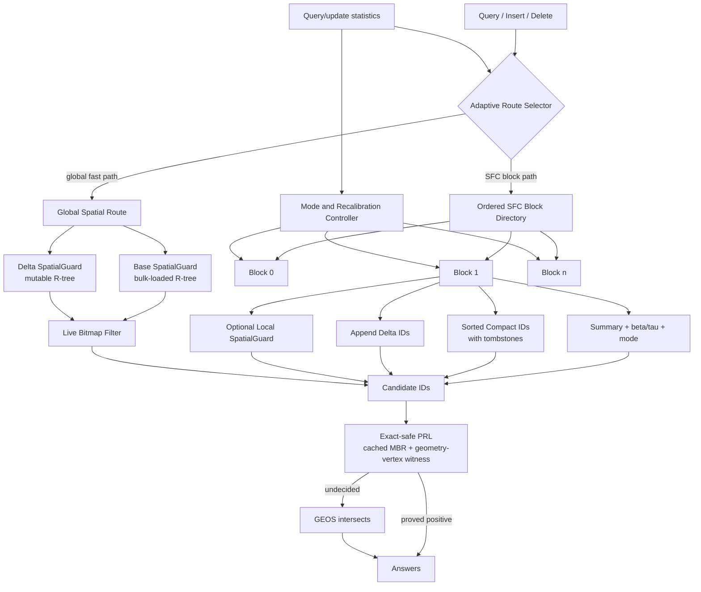

# DELI-Adaptive-PRL-Fusion 设计与实现说明

最后更新日期：2026-07-15

本文档描述当前代码中的 `DELI_ADAPTIVE_PRL_FUSION`（下文简称
`DELI-Fusion`），用于支撑论文的方法、结构图、算法流程、消融和对比方法设计。
实现入口位于 `src/benchmark/bench_dynamic_compare_wkt.cpp`。

## 1. 方法定位与术语边界

DELI-Fusion 面向动态非点空间对象。每个线或多边形首先被空间填充曲线编码为 extent：

```text
Geometry -> (zmin, zmax, MBR, object_id)
```

索引必须同时解决四类成本：

```text
1. SFC interval overlap 导致的 block/record 扫描；
2. MBR false positives 导致的候选膨胀；
3. GEOS exact predicate 的高 CPU 成本；
4. 动态 insert/delete 引起的排序、压实和空间索引维护成本。
```

当前实现不是一个新的回归模型，也不是 HIRE 的 RCU 复现。Fusion 构造函数使用
`single_store=true`，因此不维护 ALEX 数据副本。代码中的 `LearnedCompact` 名称表示
“面向查询优化的有序 compact block”，并不表示该 block 内存在 `y=ax+b` 模型。

因此论文中应使用以下准确表述：

```text
DELI-Fusion is a predicate-cost-aware, dual-route dynamic spatial index
over SFC extents. It combines a cost-partitioned SFC block overlay with an
update-light global spatial guard, and adapts query routing and local
maintenance to the observed workload.
```

不应声称：

```text
- Fusion 当前训练了新的 learned leaf/internal model；
- Fusion 当前实现了无锁 RCU model retraining；
- Fusion 超过 R-tree 完全来自 learned model；
- global guard 只是一个 correctness 辅助结构。
```

最后一点尤其重要：global guard 是一条完整的 Boost R-tree 查询路径。Fusion 的创新必须
定位为双路径协同、update-light guard 维护、predicate-aware cost partition 和自适应路由，
而不是把 R-tree fast path 的收益归因于 learned search。

## 2. 核心观察与创新点

### 2.1 Predicate cost，而不只是 search cost

传统 SFC/learned index 主要优化“如何更快找到一维位置”，但非点对象查询还需要：

```text
z-interval overlap -> MBR test -> exact geometry predicate
```

在 AW、LW 等数据上，GEOS `intersects()` 的成本可能占查询时间的大部分。因此 Fusion 的
bulk partition 和运行时统计显式纳入：

```text
records_scanned
mbr_candidates
predicate_shortcuts
exact_calls
measured GEOS exact time
```

创新点不是单独增加一个 shortcut，而是让数据划分、路由和维护决策围绕端到端空间谓词
成本，而不是只围绕模型误差或一维查找步数。

### 2.2 Cost-partitioned SFC overlay + spatial guard 双路径

Fusion 同时维护：

```text
Path A: cost-partitioned SFC block overlay
Path B: global Base SpatialGuard + Delta SpatialGuard
```

系统先测量两条路径的真实查询时间，再用带 hysteresis 的规则选择路径。当空间对象的
SFC extent 重叠严重时，系统可以绕过 block scan。当前实现只在 warm-up 阶段比较路径；
一旦 global fast path 开启，后续不会周期性重测 SFC path，因此还不能自动响应 stale/delta
增长或 workload drift。

这是一种 workload-adaptive route selection，而不是全局固定使用 learned index 或 R-tree。

### 2.3 Update-light global guard

直接维护一棵动态全局 R-tree 会使 insert/delete 变贵。Fusion 将其分解为：

```text
Base SpatialGuard:
  bulk load 构建；之后不做逐条 insert/delete。

Delta SpatialGuard:
  只接收新插入对象；规模远小于 base tree。

Live bitmap:
  删除只清除 live bit，不同步执行 RTree::remove。
```

查询同时访问 base 和 delta，并用 live bitmap 过滤 stale entries。这把 RLR 风格 lazy
deletion、SingleStore append-first 更新和 R-tree 空间剪枝统一到一条可验证路径中。

### 2.4 Block-local adaptive maintenance

SFC overlay 的每个 block 根据 query/insert/delete 统计进入三种逻辑模式：

```text
LearnedCompact:
  更积极压实，优先保护查询延迟。

SingleStoreDelta:
  放宽 insert delta 阈值，优先保护插入吞吐。

ColdLazy:
  放宽 delete compaction 阈值，优先保护删除吞吐。
```

这些模式不改变 correctness，只改变 `beta/tau` 对应的压实阈值。局部 deleted-slot reuse、
可选 local SpatialGuard 和 budgeted recalibration 进一步减少结构维护成本。

### 2.5 Exact-safe Predicate Refinement Layer (PRL)

MBR 过滤后依次执行两种确定安全的正向 shortcut：

```text
1. query rectangle 完全包含 object MBR -> intersects 必为 true；
2. GEOS `Geometry::getCoordinate()` 返回的一个真实 geometry vertex 位于
   query rectangle 内
   -> intersects 必为 true。
```

无法证明时才调用 GEOS。shortcut 不做负向排除，因此不会产生 false negative。
这里的 coordinate 不是质心、MBR 中心或任意采样点：GEOS 接口契约明确规定
`getCoordinate()` 返回 geometry 的一个 vertex，空 geometry 则返回空指针。因此，该点
位于查询矩形内时，它本身就是两个几何对象的公共点。这一机制在代码和兼容性参数中仍沿用
`representative_point` 命名，但论文、结构图和算法中统一称为 **geometry-vertex witness**。
Fusion 始终复用预计算的 `metadata_[oid].envelope`，不得在每个候选上重复调用
`Geometry::getEnvelopeInternal()`。2026-07-14 的性能回归正是违反这一不变量造成的。

### 2.6 创新边界

各组件单独看并非全新：SFC、R-tree、delta index、tombstone、DP partition 和 runtime
routing 都有相关先例。当前最可辩护的系统贡献是：

```text
1. 针对动态非点对象，将 scan/MBR/shortcut/exact/update 成本统一进 block partition；
2. 设计 base guard + single delta guard + live mask 的 update-light 空间路径；
3. 用真实路径延迟在 SFC overlay 与 spatial guard 之间自适应路由；
4. 在同一结构中协调 block mode、lazy deletion、slot reuse 和预算式重校准。
```

如果消融显示 global guard 始终接管查询，而 SFC path、mode switching 和 local guard 没有
独立收益，审稿人可能把方法概括为“R-tree + delta R-tree + bitmap”。因此论文必须提供
route/partition/update 逐层消融，不能只报告 Full Fusion。

## 3. 整体索引结构

### 3.1 共享对象与元数据层

几何对象只保存一份。每个 `object_id` 对应：

```text
Geometry store: original GEOS geometry
Metadata:       zmin, zmax, cached MBR
State:          live bit, in_delta bit, object_to_block pointer
```

`live` 是查询 correctness 的最终可见性判断。所有 stale base/delta entries 都必须经过
该 bitmap 过滤。

### 3.2 SFC block overlay

overlay 由按 `zmin` 顺序排列的 block directory 和一组 block 构成。directory 当前是
`vector<Block*>` + boundary binary search/ordered scan，不是 learned model。

每个 block 包含：

```text
Header:
  block_id
  min_zmin, max_zmin, max_zmax
  union MBR
  live_count, live_delta_count, dead_count
  beta, tau, mode, hotness counters

Compact region:
  compact_ids sorted by zmin
  deleted entries remain as tombstones until reuse/compaction

Delta region:
  append-oriented delta_ids

Optional local guard:
  Boost R-tree over live compact entries only
```

block summary 必须保持 conservative：插入时只扩张；删除后允许 stale-large，但不允许
stale-small。旧 summary 可以多访问 block，但不能漏掉答案。

### 3.3 Global spatial route

全局路径包含：

```text
Base SpatialGuard:  initial objects 的 bulk-loaded Boost R-tree
Delta SpatialGuard: inserted objects 的 mutable Boost R-tree
Live bitmap:        lazy delete visibility
Route statistics:   overlay/guard probe time and fast-path state
```

base tree 中的删除对象和 delta tree 中后续被删除的对象都会变成 stale entry，查询通过
`live[oid]` 跳过。当前实现记录 stale ratio，但没有自动执行 full base rebuild；长时间实验
必须单独报告这一退化风险。

### 3.4 结构草图



## 4. 论文结构图如何绘制

参考 HIRE 论文 Fig. 2 的“上层结构 + 叶层展开 + 局部放大”组织方式，但不能照搬其
model equation，因为 Fusion 当前没有 model leaf。

### 4.1 推荐版式

使用横向双栏宽度的 solution-overview figure，分三层：

```text
Top: Adaptive Route Selector
  左侧箭头进入 SFC Block Path；右侧箭头进入 Global Spatial Path。

Middle-left: Cost-Partitioned SFC Directory
  画 B0, B1, ..., Bn；每个 block header 标出 z-range、MBR、mode。

Middle-right: Update-Light Global Guard
  Base R-tree + Delta R-tree + Live Bitmap，三者汇合到 candidate stream。

Bottom: Zoom-in of Block Bi
  Header | sorted compact region | tombstones | append delta | optional local guard。

Far right: Common Refinement
  Cached MBR -> PRL shortcuts -> GEOS exact -> answers。
```

### 4.2 图例和符号

```text
D_z : ordered SFC block directory
B_i : block i
S_i : conservative block summary
C_i : sorted compact region
Delta_i : append delta region
G_i : optional local SpatialGuard
G_B : global base SpatialGuard
G_D : global delta SpatialGuard
V : live bitmap
M_i : block mode and beta/tau metadata
```

删除记录用灰色填充并加斜线，不能只靠红色区分。insert 使用实线箭头，delete 使用虚线，
recalibration 使用点划线。

### 4.3 配色与工具

采用色盲友好的 Okabe-Ito 配色：

```text
SFC path:       blue #0072B2
Global guard:   green #009E73
Delta/update:   orange #E69F00
Delete/stale:   vermillion #D55E00 + hatch
Recalibration:  purple #CC79A7
Metadata:       neutral gray
```

第一版用 Figma 或 PowerPoint，定稿导出 PDF/SVG；若要求 LaTeX 字体完全一致，再转 TikZ。
缩放到论文双栏宽度后字体不低于 8 pt，不使用渐变、阴影或 3D 效果。

建议 caption：

```text
Figure X: Structure of DELI-Fusion. A cost-partitioned SFC block overlay
and an update-light base/delta spatial guard share one geometry store and
an exact-safe predicate refinement layer. Runtime probes route queries to
the cheaper path, while inserts and deletes are absorbed by delta storage
and a live bitmap before budgeted local recalibration.
```

## 5. Bulk Loading 与数据划分

### 5.1 元数据生成

对每个初始对象计算：

```text
(zmin, zmax) = SFC extent projection(object)
MBR          = object envelope
```

所有 `object_id` 按 `(zmin, tie-breaker)` 排序。排序后的序列只用于 SFC overlay；global
base guard 独立使用所有初始对象的 MBR bulk load。

### 5.2 Calibration query sampling

从 calibration query 中等距抽样，默认最多：

```text
COST_PARTITION_QUERY_SAMPLE=128
```

每个 query 同样转换为 `(qzmin, qzmax, query_MBR)`。这些 query 只用于估算分区成本，
不改变查询答案。

### 5.3 候选边界

默认 `BLOCK_SIZE=512` 时：

```text
min block size = max(64, B/2) = 256
max block size = max(B, 2B)   = 1024
boundary step  = max(32, B/8) = 64
```

因此 DP 不在每个 object 位置尝试边界，而是在步长为 64 的位置上搜索，控制构建成本。

### 5.4 Segment cost

对候选段 `[i,j)` 先构建 summary：

```text
min_zmin, max_zmin, max_zmax, union_MBR
```

然后在 sampled queries 上估算：

```text
C(i,j) = C_block_check
       + c_scan     * estimated_scanned_records
       + c_mbr      * estimated_mbr_candidates
       + c_shortcut * estimated_shortcuts
       + c_exact    * estimated_exact_calls
       + C_dirty_query
       + C_update_maintenance
```

其中 record-level predicate 数通过段内最多 64 个 sampled records 外推。`C_dirty_query`
使用 workload insert/delete ratio 估算未来 delta/tombstone 扫描，maintenance 项估算压实成本。

### 5.5 Dynamic programming

设候选边界为 `p_0 ... p_m`：

```text
dp[j] = min_i { dp[i] + C(p_i, p_j) }

subject to:
  min_block <= p_j - p_i <= max_block
```

回溯 parent 数组得到最终分段。若 DP 无可行解或没有 calibration query，则退化为固定大小
block partition。每个分段随后生成一个 compact block、summary 和 object-to-block 映射。

### 5.6 Global guard 初始化

完成 overlay 后：

```text
1. 对所有 initial live MBR bulk-load Base SpatialGuard；
2. Delta SpatialGuard 为空；
3. stale_count=0；
4. global_fast_path=false；
5. 前台查询开始后再通过 probe 选择路径。
```

## 6. 查询流程

### 6.1 路由选择

初始查询走 SFC overlay，同时对 global guard 做 probe。至少获得 4 个样本后：

```text
if guard_time * 1.05 < overlay_time:
    global_fast_path = true
else if overlay_time * 1.10 < guard_time:
    global_fast_path = false
```

最多收集 8 次 probe。5%/10% 的非对称门限构成 hysteresis；但当前查询在开启 global
fast path 后直接返回，不再继续 probe overlay，所以这是一次 warm-up route selection，
不是持续在线切换。代码中的回切分支只有在未来加入周期性 re-probe 后才能真正发挥作用。

### 6.2 Global fast path

```text
1. Base SpatialGuard.query(query_MBR)
2. Delta SpatialGuard.query(query_MBR)
3. live bitmap 过滤 stale/deleted ids
4. cached object MBR containment shortcut
5. geometry-vertex-witness positive shortcut
6. 对剩余候选调用 GEOS intersects
7. 合并答案
```

该路径不访问 block directory，因此在低选择性查询中接近 Boost R-tree 的空间剪枝能力；
它比普通 Boost 动态 R-tree 的更新更轻，因为 base tree 不执行逐条修改。

### 6.3 SFC block path

```text
1. query geometry -> (qzmin, qzmax, query_MBR)
2. 顺序检查 directory；当 block.min_zmin > qzmax 时提前停止
3. 用 max_zmax 和 block MBR 跳过不相交 block
4. 若 local guard clean，则查询 local guard
5. 否则扫描 compact prefix（zmin <= qzmax）
6. 扫描 live delta ids
7. 用 zmax、object MBR、PRL 和 GEOS 逐层 refinement
8. 记录 block scan、candidate、exact-call 统计
```

查询计时结束后，当前单线程近似实现最多为一个 hot block 构建 local guard。它不是实际
后台线程，论文中应称为 deferred/budgeted foreground simulation，并单独报告其 CPU 成本。

## 7. 插入流程

### 7.1 Global-fast 模式

```text
1. 根据 zmin 定位目标 block
2. object_id append 到 block.delta_ids
3. 设置 live=true, in_delta=true, object_to_block=block
4. conservative-expand block z-range/MBR summary
5. object MBR 插入 Delta SpatialGuard
6. 返回；不扫描 deleted slots，不触发前台 compaction
```

该路径避免更新大规模 Base SpatialGuard，也避免为当前不使用的 SFC query layout 立即排序。

### 7.2 SFC 模式

```text
1. 定位 block 并更新 insert statistics/mode
2. 若存在 dead slot 且不破坏 compact zmin 顺序，则复用 slot
3. 否则 append 到 delta_ids
4. conservative-expand summary
5. 若 delta 超过 adaptive beta threshold，则加入 rebuild queue
6. 同步插入 Delta SpatialGuard，保证任一路由都能看到新对象
7. 按预算执行至多一个 pending recalibration
```

deleted-slot reuse 只在 dead slots 不少于 8、global fast path 未开启且前后顺序允许时执行。

## 8. 删除流程

### 8.1 Global-fast 模式

```text
1. global_guard_stale_count++
2. live[oid]=false
3. 清除 object_to_block；必要时清除 in_delta
4. 更新 block live/dead/delta counters
5. 保留 Base/Delta SpatialGuard 中的旧 entry
```

查询通过 live bitmap 过滤该 entry，因此 correctness 不受影响。代价是 stale entries 随时间
增加；长期运行必须监控：

```text
global_guard_stale_count / global_guard_live_count
```

### 8.2 SFC 模式

除上述 lazy visibility update 外，还会：

```text
1. 更新 delete statistics/mode
2. 将覆盖 compact region 的 local guard 标为 dirty
3. dead_count 达到 adaptive tau threshold 时加入 rebuild queue
4. 若关闭 deferred summary refresh，可立即刷新 critical summary
5. 按预算执行 pending recalibration
```

删除后的 stale-large summary 只会多扫，不会漏答。

## 9. “模型重训练”与局部重校准

### 9.1 当前实现没有 model retraining

当前 Fusion 没有 per-block regression model，也没有 model leaf/internal model。因此方法章节
不应把 `compact_block()` 称为 model retraining。准确名称是：

```text
cost-driven local recalibration / block reorganization
```

### 9.2 触发条件

block 的逻辑模式调节阈值倍率：

```text
LearnedCompact:   insert/delete threshold 更积极
SingleStoreDelta: insert threshold 更宽松
ColdLazy:         delete threshold 更宽松
```

基础阈值为：

```text
insert threshold = ceil(beta * mode_multiplier * compact_size)
delete threshold = ceil(tau  * mode_multiplier * compact_size)
```

当 `COST_COMPACTION_HORIZON>0` 时，还会比较未来查询收益与当前压实成本；用户常用命令
设置为 `0`，此时主要由 beta/tau threshold 触发，不应声称启用了 horizon cost trigger。

### 9.3 执行流程

```text
1. 将 block 标记 fusion_pending_rebuild 并去重入队
2. 每次更新最多消费一个 block，且两次执行至少间隔 8 operations
3. 收集 live compact ids 和 live delta ids
4. 对 delta 排序，与 compact 有序 merge
5. 物理移除 tombstones，清空 delta
6. 精确重算 z-range、max_zmax 和 block MBR
7. 丢弃过期 local guard
8. 若 compact_size > 2 * BLOCK_SIZE，则二分 split
```

这是同线程 budgeted maintenance，不是 HIRE 的 RCU、MLS pointer swap 或真实后台线程。

### 9.4 若未来需要真正的模型重训练

只有在加入以下结构后，论文才能使用 model retraining：

```text
1. 在 block directory 或 block 内加入真实 key-position model；
2. 记录 model error bound；
3. query 使用 prediction + bounded correction；
4. recalibration 重新拟合 model，并记录训练成本；
5. 并发版本才需要 RCU/pointer swap。
```

这会改变当前方法和实验，应作为独立增强，而不是仅修改术语。

## 10. Cost model 总结

Fusion 包含三个不同时间尺度的决策：

```text
Build time:
  DP 根据 sampled query 的 scan/predicate/update cost 划分 blocks。

Query warm-up:
  根据真实 wall-clock path latency 选择 overlay 或 global guard。

Runtime maintenance:
  beta/tau、block mode、dirty ratio 和可选 horizon cost 决定何时重校准。
```

三者共同构成方法，而不是单一公式。实验必须分别报告：

```text
block_checks, records_scanned, mbr_candidates
predicate_shortcuts, exact_calls, geos_exact_ns
global_guard_fast_path, stale_count, delta_count
mode_switches, slot_reuse, local_guard_builds
recalibration_count/time, memory
```

## 11. 对比方法及实验角色

| 方法                                   | 核心结构                                                       | 动态更新                                                | 在实验中的作用                                                     |
| -------------------------------------- | -------------------------------------------------------------- | ------------------------------------------------------- | ------------------------------------------------------------------ |
| `DELI_ALEX_HYBRID_COST`              | ALEX write layout + compact query overlay + cost partition     | 双结构维护、lazy delete、adaptive beta/tau              | 验证去掉 ALEX 数据副本和 Fusion routing 的收益                     |
| `DELI_ALEX_HYBRID_SINGLE_STORE_COST` | 单一 compact/delta overlay + cost policy                       | append delta + local compaction                         | Fusion 的直接底座；代表低内存、高 insert baseline                  |
| `DELI_ADAPTIVE_PRL_FUSION`           | cost-partitioned SFC overlay + local/global guards + PRL       | single delta guard + live mask + budgeted recalibration | 主方法                                                             |
| `RLR_LITE_CS_SPLIT`                  | RLR-inspired lightweight R-tree，RL-lite ChooseSubtree + split | 原生树更新/轻量策略                                     | 比较空间层级与低 delete latency；不是完整 RL-RTree                 |
| `HIRE_SFC_LITE`                      | SFC extent wrapper + 简化 hybrid leaves/learned directory      | buffer、lazy delete、local rebuild                      | HIRE-inspired 轻量 learned baseline                                |
| `HIRE_SFC_FULL`                      | 更完整 internal log、hybrid leaves、RCU/MLS、bulk optimization | 局部版本发布与重校准                                    | 评估论文级动态机制在空间 extent wrapper 下的开销                   |
| `Boost_Rtree`                        | 原生 Boost R-tree over MBR                                     | 同步 insert/remove                                      | 最重要的原生空间索引 baseline，也是 Fusion global guard 的构件来源 |
| `GEOS_Quadtree`                      | GEOS Quadtree                                                  | 原生动态更新                                            | 另一类传统空间划分 baseline                                        |
| `GLIN_PIECEWISE`                     | SFC linearization + piecewise learned mapping                  | GLIN 动态路径                                           | 原始 learned spatial baseline                                      |

所有支持的 wrapper 应使用相同 PRL 设置。由于 Fusion 内部包含 Boost R-tree，论文必须同时
报告 Fusion 与 Boost 的 query、insert、delete、memory 和 stale/delta 代价，避免只比较
query latency。

## 12. 最新结果快照

结果文件：

```text
results/smoke_hire_sfc_full_stage1/dynamic_compare_summary.csv
```

配置：AW 2M、read-heavy mixed、1M operations、40K checkpoint、0.001% selectivity、
`PREDICATE_SHORTCUTS=1`。该大实验设置了 `CHECK_CORRECTNESS=0`，因此性能趋势可用，
正式论文结果仍需抽样开启 correctness。

| 方法                  |      Avg query ms |      P95 query ms |        Query TPS |        Insert TPS |          Delete TPS |      Overall TPS |       Memory MB |
| --------------------- | ----------------: | ----------------: | ---------------: | ----------------: | ------------------: | ---------------: | --------------: |
| DELI-Fusion           | **0.04735** | **0.24836** | **21,170** | **489,203** | **1,829,348** | **23,456** |          107.64 |
| Boost R-tree          |           0.05144 |           0.27176 |           19,479 |           429,681 |             468,377 |           21,544 | **68.66** |
| DELI-ALEX-Hybrid-Cost |           0.06443 |           0.30180 |           15,545 |           426,775 |           1,656,523 |           17,232 |           59.84 |
| DELI-SingleStore-Cost |           0.06591 |           0.30912 |           15,203 |         1,116,689 |           1,633,990 |           16,875 | **27.42** |
| HIRE-SFC-Lite         |           0.07567 |           0.35730 |           13,243 |            34,470 |              36,470 |           13,995 |          146.18 |
| HIRE-SFC-Full         |           0.08755 |           0.38711 |           11,431 |            36,077 |              88,217 |           12,384 |          280.35 |
| GEOS Quadtree         |           0.20482 |           0.65700 |            4,883 |           294,575 |             234,116 |            5,416 |           53.40 |
| GLIN Piecewise        |           0.38215 |           0.88566 |            2,618 |           264,449 |             329,770 |            2,906 |           45.77 |

在这一个配置上，Fusion 相比 Boost：

```text
avg query latency: 约低 8.0%
query throughput:  约高 8.7%
overall throughput:约高 8.9%
memory:            约高 56.8%
```

不能从单个 AW/selectivity/profile 推导“所有场景全面超过”。需要继续报告 LW、PARKS、
ROADS、多选择性、balanced/write-heavy、长时间 stale growth 和内存。

## 13. 必要消融

当前最重要的不是继续叠加机制，而是把收益拆开：

```text
A0 SingleStore-Cost
A1 + predicate-aware DP partition
A2 + block modes / adaptive beta-tau
A3 + deleted-slot reuse
A4 + local SpatialGuard
A5 + global Base SpatialGuard only
A6 + single Delta SpatialGuard + live-mask delete
A7 + adaptive route selector (Full Fusion)
A8 + geometry-vertex-witness shortcut
```

还需要专门的路由消融：

```text
FORCE_SFC_PATH
FORCE_GLOBAL_GUARD_PATH
ADAPTIVE_ROUTE
DELI_FUSION_GUARD_ONLY
```

当前代码已经提供 `FUSION_ROUTE_MODE=adaptive|force_sfc|force_guard`。由于历史实现会让
fast route 同时改变更新维护，严格路由消融还必须把三组统一设置为
`FUSION_UPDATE_MODE=light` 或 `full`；`coupled` 只用于复现默认完整系统。否则无法证明
Fusion 的优势来自查询自适应，而不是同时改变了 update path。

`force_guard` 仍会构建 SFC blocks，并在更新时维护 block locator/delta，因此它只隔离查询
路由，不隔离结构成本。当前新增的 `DELI_FUSION_GUARD_ONLY` 是真正的结构消融：仅保留
bulk-loaded Base R-tree、mutable Delta R-tree、live bitmap lazy deletion 和相同的 PRL/GEOS
refinement。其 SFC block、directory、compact ID、object locator 和局部维护统计必须为 0。
正式归因必须同时比较 Adaptive、Force SFC、Force Guard、Guard-only 和 Boost R-tree。

每组消融至少报告：

```text
avg/p95/p99 query latency
insert/delete latency and throughput
overall throughput
build time and memory
records scanned / MBR candidates / exact calls / GEOS time
global guard stale ratio / delta size
recalibration count and total CPU time
answers_match_boost
```

## 14. Correctness invariants

```text
1. live=false 的对象绝不能进入答案；
2. 每个 live object 必须位于 compact 或 delta，并可由 object_to_block 定位；
3. compact_ids 按 zmin 有序；slot reuse 不得破坏该顺序；
4. insert 后 block summary 必须立即 conservative-expand；
5. delete summary 可以 stale-large，不得 stale-small；
6. global base/delta guard 中的 stale entry 必须经过 live bitmap；
7. local guard dirty 时必须回退扫描路径；
8. PRL 只能做确定安全的 positive shortcut；`getCoordinate()` 必须保持为真实 geometry
   vertex，不得替换为 centroid、envelope center 或其他不保证落在 geometry 上的点；
9. cached metadata envelope 必须与 geometry envelope 一致；
10. recalibration 前后答案集合必须保持不变。
```

正式实验至少对每个 dataset/profile/selectivity 抽样运行：

```bash
CHECK_CORRECTNESS=1 CORRECTNESS_EVERY_N=1
```

## 15. 风险与下一步

### 15.1 当前风险

```text
1. Global guard 使内存显著高于 Boost 和 SingleStore-Cost；
2. stale base entries 与持续增长的 delta tree 可能造成长期查询退化；
3. fast path 开启后，block mode/local guard/recalibration 大多被绕过；
4. 当前 route probe 样本很少且开启 fast path 后不再重测，可能受 cache warm-up、偶然噪声
   和后续 workload drift 影响；
5. local guard build 在 query 计时后、但仍在同线程执行，不能称为免费后台工作；
6. 当前没有真实 learned model，方法命名和论文叙述必须避免误导。
```

### 15.2 优先工作

```text
1. 已完成 FORCE_SFC/FORCE_GUARD/ADAPTIVE 查询路由与 Guard-only 结构消融；
2. 先用 Guard-only 定量判断 SFC 的净收益，再决定是否进入滚动路由；
3. 为 base guard 增加 stale/delta cost-driven rebuild，并单独计费；
4. 将 route probe 改为滚动窗口与 cooldown，避免只由前 4 次 query 决定；
5. 完成各组件消融和长时间退化实验；
6. 如果仍要突出 learned contribution，再设计真实 learned directory/model retraining；
7. 报告 memory/query/update 三维 trade-off，而不是只报告查询胜出。
```

## 16. 论文贡献表述建议

英文贡献可以写为：

```text
1. We identify that the dominant cost of dynamic spatial queries over
   non-point objects lies jointly in SFC overlap, candidate refinement, and
   exact predicates, rather than in one-dimensional lookup alone.

2. We propose DELI-Fusion, a predicate-cost-aware dual-route index that
   combines a cost-partitioned SFC block overlay with an update-light spatial
   guard consisting of an immutable base tree, a mutable delta tree, and lazy
   visibility filtering.

3. We develop workload-adaptive routing and block maintenance that coordinate
   compact layouts, append deltas, lazy deletion, slot reuse, and budgeted
   recalibration without changing query semantics.

4. We evaluate the resulting query-update-memory trade-off against learned,
   R-tree, quadtree, RLR-inspired, and HIRE-inspired baselines under mixed
   workloads over real non-point spatial datasets.
```

更保守、也更容易通过审稿的标题方向是：

```text
Predicate-Cost-Aware Adaptive Indexing for Dynamic Non-Point Spatial Objects
```

而不是强调一个当前代码中不存在的新 learned model。

## 17. 代码映射

| 机制               | 主要实现位置/函数                                            |
| ------------------ | ------------------------------------------------------------ |
| Fusion block/state | `FusionBlockMode`, `LocalBoundedOverlayBlock`            |
| Bulk partition     | `bulk_load_adaptive_partition()`                           |
| Segment cost       | `adaptive_partition_segment_cost()`                        |
| SFC query          | `LocalBoundedCompactQueryOverlay::query()`                 |
| Global route       | `query_fusion_global_guard()`                              |
| Route decision     | `refresh_fusion_global_guard_route()`                      |
| Insert/delete      | `insert()`, `erase()`                                    |
| Slot reuse         | `try_reuse_deleted_slot()`                                 |
| Local guard        | `maybe_build_fusion_spatial_guard()`                       |
| Recalibration      | `apply_fusion_recalibration_budget()`, `compact_block()` |
| PRL                | `apply_conservative_predicate_layer()`                     |
| Debug counters     | `deli_fusion_debug.csv`                                    |
